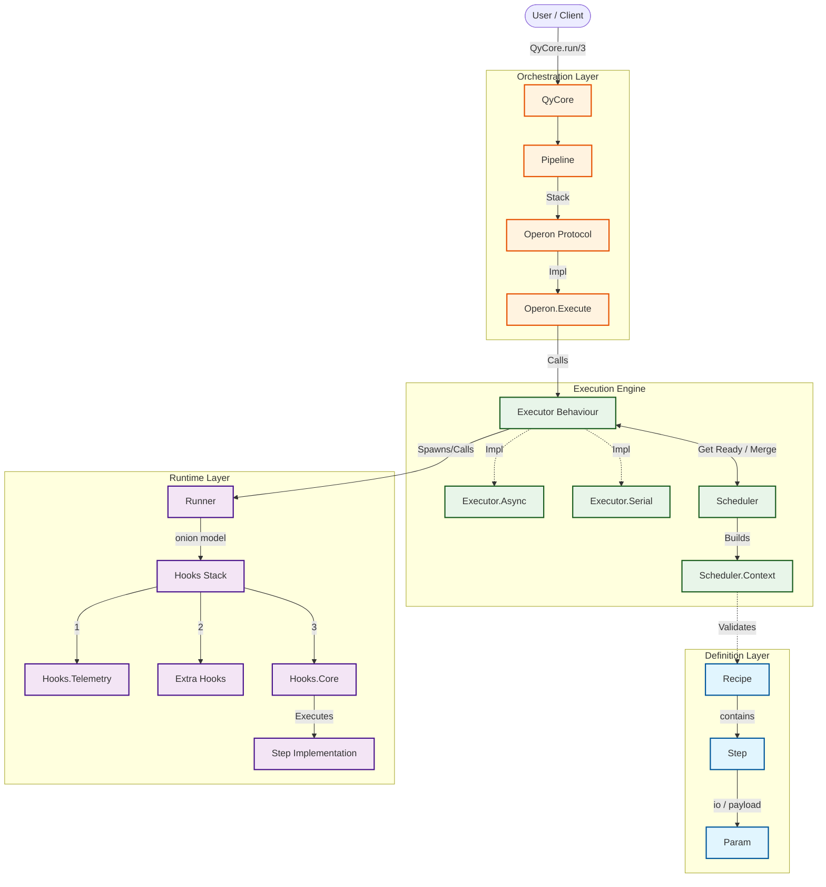
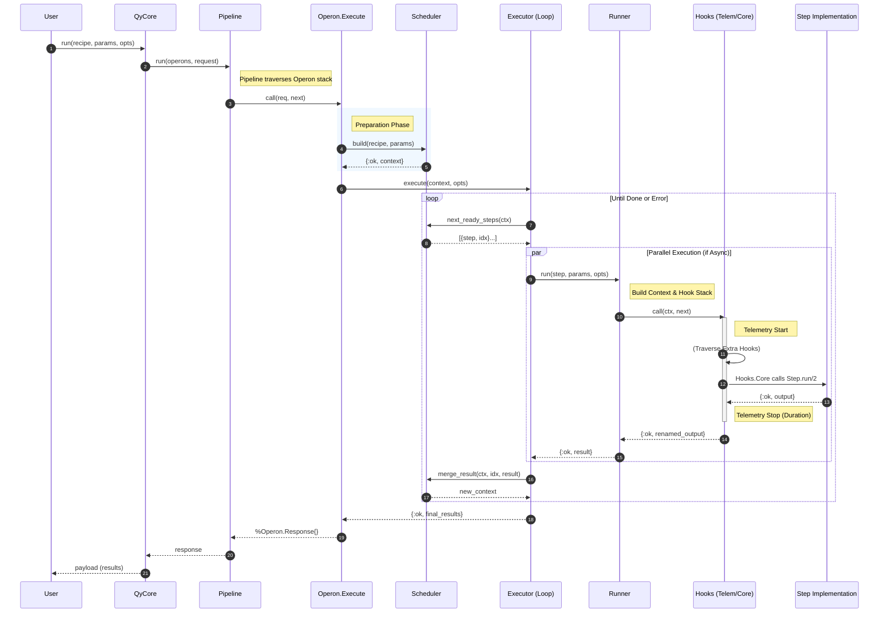

# QyCore

QyCore is an Elixir-based workflow orchestration engine inspired by a [personal project](https://ges233.github.io/2023/06/Qy-project/)(written in Chinese).

It is primarily designed for scenarios requiring complex processing of time series (or sequences related to time series) with low real-time demands, providing a relevant protocol or interface for subsequent development.

## Graph

### Arch



### Flow



## Responsibilities

### Definition

#### `QyCore.Param`

#### `QyCore.Step`

#### `QyCore.Recipe`

### Scheduling

Mainly handled by the `QyCore.Scheduler` module.

### Execution Behavior and Executors

Recipe-level execution is the responsibility of the `QyCore.Executor` behavior.

Currently, `qy_core` includes two executors:

- `QyCore.Executor.Serial`
- `QyCore.Executor.Async`

Step-level execution is handled by `QyCore.Runner.run/3`.

Due to the atomic nature of Step operations, no further behavior-adapter design has been implemented. However, considering business complexity, a hook mechanism has been introduced.

### Layered Hooks

#### Step Level (Hook)

Within `QyCore.Runner`, which is responsible for executing steps, data flows like an onion from the outer layers through the inner layers and back to the outer layers.

The general flow for each hook is as follows:

```elixir
defmodule MyHook do
  @behaviour QyCore.Runner.Hook

  def call(ctx, next) do
    # Prelude
    ...

    # Execute inner part
    case next.(ctx) do
      # When success
      {:ok, result} ->
        ...

      # When failed
      {:error, term} ->
        ...
    end
  end
end
```

Therefore, at a macro level, the order and definition of Hooks need careful consideration.

To run additional Hooks, they must be configured in the step's `opts[:extra_hooks_stack]`.

Currently, Runner has two hooks:

- `QyCore.Runner.Hooks.Telemetry` for telemetry
- `QyCore.Runner.Hooks.Core` for executing the step

#### Recipe Level (Pipeline & Operon)

Similar to hooks, data is also processed in an onion-like flow.

It has a somewhat peculiar name—Operon (may be changed later).

The execution is handled by `QyCore.Pipeline`  which calls a series of middleware conforming to the `QyCore.Operon` protocol.

However, the difference is that we define two structs: `QyCore.Operon.Request` and `QyCore.Operon.Response`.

The transformation module is `QyCore.Opeon.Execute`, which wraps the Executor.

No additional middleware has been introduced yet, but it will be added later.

### Runtime Context Passing

- Pipeline level
  - `%QyCore.Openron.Request{}` & `%QyCore.Openron.Response{}`
- Executor level
  - `%QyCore.Scheduler.Context{}`
  - Executor's own context
- Runner Hooks level
  - `%QyCore.Runner.Context{}`
- Step level

#### Options

TBD

### Traversal Injection

#### Modifying step

#### Modifying recipe

<!--roadmap:begin-->

## Roadmap

- [x] Declarative steps
- [x] Flow orchestration
- [x] Nested recipes
- [x] Executor protocol and implementations
- [x] Hooks
- [o] Pre-run modifications
  - [x] Step configuration (via `QyCore.Recipe.assign_options/3`)
  - [x] Recipe configuration
  - [o] Operon stack modification (via configuration changes)
  - [o] Internal hook stack modification for steps (can be done by modifying step configuration)
- [x] Pre-run checks(`QyCore.Scheduler.build/2`)
  - [x] Missing Recipe check
  - [x] Recipe cycle check
  - [x] Step option check (implemented at the step level)
- [o] Runtime modifications
  - *Only for steps not yet executed*
  - [x] step configuration(`QyCore.Scheduler.inject_opts/3`)
  - ~~Executor configuration~~ (Depends on specific executor implementation; considering QyCore's goal of staying lean and the fact that Operon can achieve similar effects, this is abandoned)
  - [o] Recipe configuration (`Recipe.walk/3`'s `:inner_recipe` mode + custom function)
  - [o] Runner hooks (essentially still step configuration)
- [ ] API consolidation
  - [ ] Organize logic
    - Decouple relationships between Scheduler, Execute operon, and specific Executor implementations
    - Document key context
  - [ ] Write documentation & Publish to <hex.pm>
    - use English
  - [ ] 100% coverage
- [ ] Dynamic graph rewriting (adding/deleting steps)
  - *This is an optional advanced feature; similar effects can be achieved via hooks without implementing this*
  - Modify Recipe's steps (pre-run modification, mainly addition/deletion)
  - Modify Scheduler.Context's pending_steps (runtime modification, including add/update/delete)
- [ ] More OTP-style Executor
  - *Still an advanced feature, but likely requires separate plugins*
- [ ] Persistence and Traceability
  - *Another advanced feature, may require plugins or modifications to QyCore itself*

<!--roadmap:end-->

## Installation

Add to your `mix.exs`:

```elixir
[
  {
    :qy_core,
    git: "https://github.com/SynapticStrings/QyCore.git",
    branch: "core"
  }
]
```
