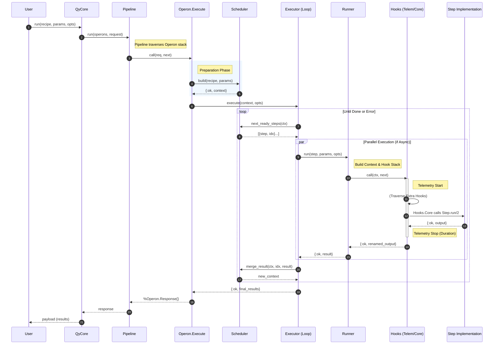

# QyCore

QyCore 是一个基于 Elixir 的，灵感源于[个人企划](https://ges233.github.io/2023/06/Qy-project/)的工作流编排引擎。

主要用于需要对时间序列（或时间序列相关的序列）进行负责处理且对实时性要求不高的场景，提供一个用于后续开发的相关协议或接口。

## Graph

### Arch


### Flow



## 职责

### 定义

#### `QyCore.Param`

#### `QyCore.Step`

#### `QyCore.Recipe`

### 调度

主要是 `QyCore.Scheduler` 模块负责。

### 执行行为与执行器

Recipe 层面的执行由 `QyCore.Executor` 行为负责。

目前 `qy_core` 包括两个执行器：

- `QyCore.Executor.Serial`
- `QyCore.Executor.Async`

Step 层面的执行由 `QyCore.Runner.run/3` 负责。

因为 Step 原子操作的性质，没有再作进一步的 behaviour-adapter 的设计，但考虑业务的复杂程度，引入了钩子机制。

### 分层钩子

#### Step 层面（Hook）

在负责运行 step 的 `QyCore.Runner` 中，数据如洋葱一般从外层经由内层再回到外层。

每个 hook 的大致流程如下：

```elixir
defmodule MyHook do
  @behaviour QyCore.Runner.Hook

  def call(ctx, next) do
    # Prelude
    ...

    # Execute inner part
    case next.(ctx) do
      # When success
      {:ok, result} ->
        ...

      # When failed
      {:error, term} ->
        ...
    end
  end
end
```

因此从宏观层面，Hooks 的顺序以及定义需要仔细考虑这点。

需要运行额外的 Hook ，需要在 step 的 `opts[:extra_hooks_stack]` 中予以配置。

目前 Runner 有两个 hooks：

- `QyCore.Runner.Hooks.Telemetry` 通信
- `QyCore.Runner.Hooks.Core` 执行 step

#### Recipe 层面（Pipeline & Operon）

和 hooks 类似，也是按照洋葱一般的数据流程处理。

起了个比较怪的名字——操纵子，可能后面会改。

负责运行的部分是 `QyCore.Pipeline` ，其调用一系列遵循 `QyCore.Operon` 协议的中间件。

但是不同的是，我们定义了两类结构体 `QyCore.Operon.Request` 以及 `QyCore.Operon.Response` 。

负责转变的模块就是包装了 Executor 的 `QyCore.Opeon.Execute` 。

暂时还没有引入额外的中间件，但后面会增加。

### 运行时上下文传递

- Pipeline 层级
- Executor 层级
- Runner Hooks 层级
- Step 层级

### 遍历注入

#### step 的修改

#### recipe 的修改

## Roadmap

- [x] 声明式步骤
- [x] 流程编排
- [x] 嵌套 recipe
- [x] executor 协议与实现
- [x] 钩子
- [o] 运行前修改
  - [x] step 配置（通过 `QyCore.Recipe.assign_options/3`）
  - [x] recipe 配置
  - [o] operon 堆修改（通过修改配置）
  - [o] step 内部的 hook 堆修改（可以通过修改 step 配置完成）
- [x] 运行前检查
  - [x] Recipe 缺失检查
  - [x] Recipe 循环检查
  - [x] Step option 检查（step 层面来实现）
- [o] 运行时修改
  - *仅针对尚未运行的 steps*
  - [x] step 配置（`QyCore.Scheduler.inject_opts/3` ）
  - ~~ executor 配置~~（需要看 executor 的具体实现，但考虑到 QyCore 保持精简，加之 operon 也可实现，放弃）
  - [o] recipe 配置（`Recipe.walk/3` 的 `:inner_recipe` 模式 + 自定义函数）
  - [o] runner hooks（本质上还是 step 配置）
- [ ] API 固化
  - [ ] 梳理逻辑
    - 解耦 Scheduler 、Execute operon 以及 Executor 具体实现的关系
    - 关键的上下文文档化
  - [ ] 编写文档
    - use English
  - [ ] 100% coverage
- [ ] 动态图重写（对 steps 的增删）
  - *这是可选的高阶功能，不实现这个也可以通过 hooks 实现类似的效果*
  - 修改 Recipe 的 steps（运行前修改，主要是增删）
  - 修改 Scheduler.Context 的 panding_steps（运行时修改，可以包括增删改）
- [ ] 更 OTP 的 Executor
  - *依旧是高阶功能，但是需要通过别的插件实现*
- [ ] 持久化与可追溯
  - *还是高阶功能，可能需要插件可能需要修改 QyCore 本体*

## 安装

在 `mix.exs` 中添加：

```elixir
[
  {
    :qy_core,
    git: "https://github.com/SynapticStrings/QyCore.git",
    branch: "core"
  }
]
```
