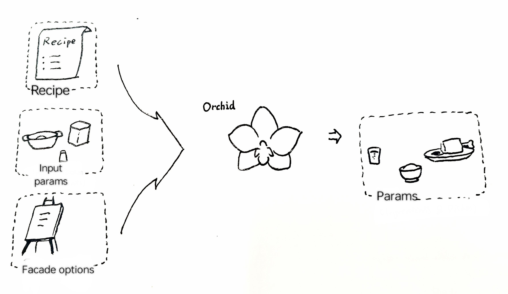
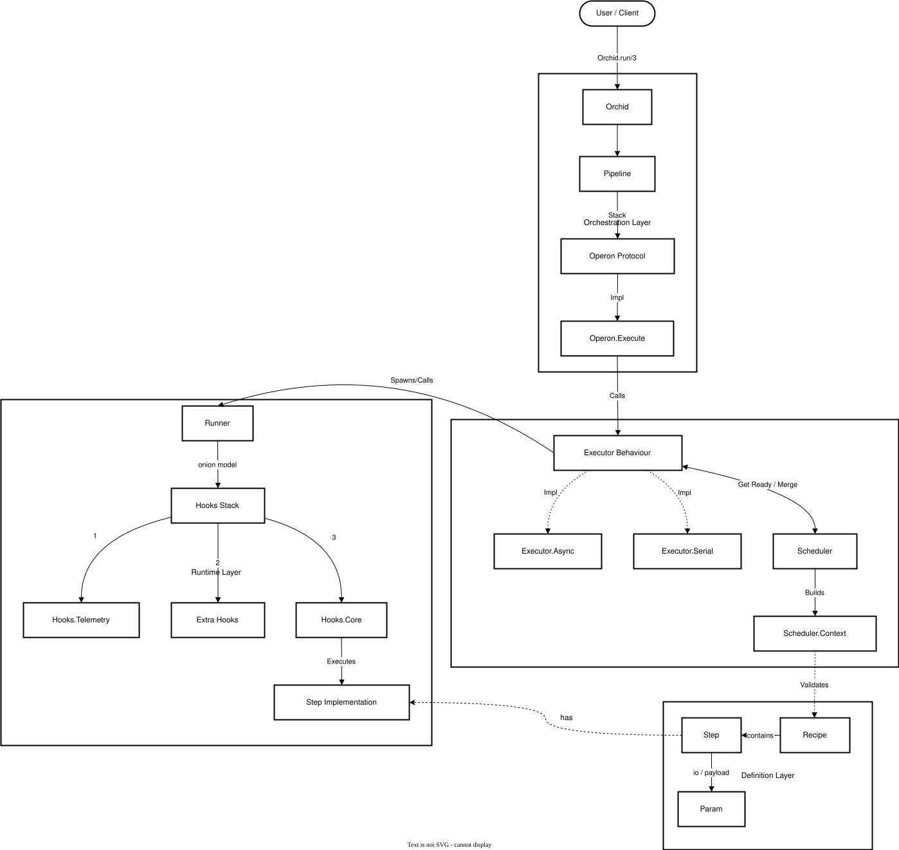
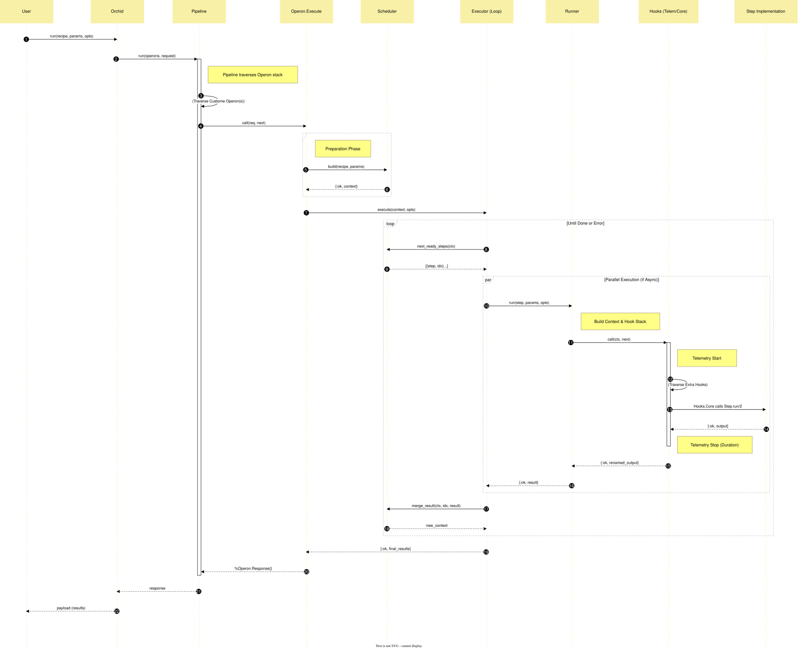

# Orchid


Orchid is an Elixir-based workflow orchestration engine inspired by a [personal project](https://ges233.github.io/2025/03/Qy-Editor-demo/)(written in Chinese).

It is primarily designed for scenarios requiring complex processing of data(time series limited originally) with low real-time demands, providing a relevant protocol or interface for subsequent development.

## Features

* **Declarative Recipes**: Define your workflow steps and dependencies clearly.
* **Flexible Execution**: Switch execution strategies(or implement and use yours) without changing business logic.
* **Composable & Nested**: Treat entire recipes as atomic steps (`NestedStep`). Supports deep configuration inheritance and parameter mapping.
* **Dependency Resolution**: Automatic topological sorting of steps based on input/output keys.
* **Onion-like Hooks**: Inject custom logic (logging, telemetry, etc.) at both the Step and Recipe levels.

## Installation

Add to your `mix.exs`:

```elixir
def deps do
  [
    {:orchid, "~> 0.3"}
  ]
end
```

## Quick Start

Well, let's make a cup of coffee to see how Orchid works.

We will define a process where beans are ground into powder, and then brewed with water. Notice how we can control the brewing style using opts.

It can explained clearly with just one picture.



### Definate Steps

Create modules that use `Orchid.Step`, or simply function with 2 arities.

```elixir
defmodule Barista.Grind do
  use Orchid.Step
  alias Orchid.Param

  # Simple 1-to-1 transformation
  def run(beans, opts) do
    amount = Param.get_payload(beans)
    IO.puts("⚙️  Grinding #{amount}g beans...")
    {:ok, Param.new(:powder, :solid, amount * Keyword.get(opts, :ratio, 1))}
  end
end

defmodule Barista.Brew do
  use Orchid.Step
  alias Orchid.Param

  # Multi-input step with options
  def run([powder, water], opts) do
    # Get configuration from opts, default is :espresso
    style = Keyword.get(opts, :style, :espresso)
    
    p_amount = Param.get_payload(powder)
    w_amount = Param.get_payload(water)
    
    IO.puts("💧 Brewing #{style} coffee with #{p_amount}g powder and #{w_amount}ml water...")
    {:ok, Param.new(:coffee, :liquid, "Cup of #{style}")}
  end
end
```

### Build Recipe

Define the workflow. Key features demonstrated here:

- **Out of Order**: We define Brew before Grind, but Orchid will figure it out.
- **Options**: We pass style: :latte to the brewing step.

```elixir
alias Orchid.{Recipe, Param}

# Initial Ingredients
inputs = [
  Param.new(:beans, :raw, 20),    # 20g beans
  Param.new(:water, :raw, 200)    # 200ml water
]

steps = [
  # Step 2: Brew (Depends on :powder and :water)
  # We want a Latte, so we pass options here.
  {Barista.Brew, [:powder, :water], :coffee, [style: :latte]},

  # Step 1: Grind (Depends on :beans, Provides :powder)
  {Barista.Grind, :beans, :powder}
]

recipe = Recipe.new(steps, name: :morning_routine)
```

### Run

Execute the recipe. Orchid automatically resolves dependencies: `Grind` runs first, then `Brew`.

```elixir
{:ok, results} = Orchid.run(recipe, inputs)
# Output:
# ⚙️  Grinding 20g beans...
# 💧 Brewing latte coffee with 20g powder and 200ml water...

IO.inspect(Param.get_payload(results[:coffee]))
# => "Cup of latte"
```

## Core Components

### Defination

- `Orchid.Param`: The standard unit of data exchange. Every step receives and returns Param structs (or lists/tuples of them). It carries the payload and metadata.
- `Orchid.Step`: An atomic unit of work. It focuses solely on processing logic, unaware of the larger workflow context.
- `Orchid.Recipe`: The blueprint that describes what needs to be done and the data dependencies between steps.

### Orchestration

Mainly handled by the `Orchid.Scheduler` module.

### Execution

Recipe-level execution is the responsibility of the `Orchid.Executor` behavior.

In step-level, function `Orchid.Runner.run/3` will handle it.

### Architecture

#### Overview

*Separation of Definition, Orchestration, and Execution layers.*



#### Lifecycle

*How a request flows through the pipeline and executor(s).*



### Advanced Usage

### Executors

Currently, orchid includes two executors:

- `Orchid.Executor.Serial`: Runs steps one by one. Good for debugging.
- `Orchid.Executor.Async`: Runs independent steps in parallel based on the dependency graph.

Due to the atomic nature of Step operations, no further behavior-adapter design has been implemented.

As business complexity increases dramatically (e.g., external resource monitoring, more fault-tolerant business environments), custom Executors are encouraged.

However, in some cases, considering business complexity, a hook mechanism has been introduced.

### Layered Hooks

Orchid employs an onion-like execution model (similar to Rack or Plug middleware), where hooks wrap around the core logic.

*Note: This refers to the runtime call stack, distinct from the 'Onion Architecture' design pattern which concerns static code dependencies and domain boundaries.*

#### Step Level (Hook)

Within `Orchid.Runner`, which is responsible for executing steps, data flows like an onion from the outer layers through the inner layers and back to the outer layers.

The general flow for each hook is as follows:

```elixir
defmodule MyHook do
  @behaviour Orchid.Runner.Hook

  @impl true
  def call(ctx, next) do
    # Prelude
    ...

    # Execute inner part
    case next.(ctx) do
      # When success
      {:ok, result} ->
        ...

      # When failed
      {:error, term} ->
        ...
    end
  end
end
```

Therefore, the order and definition of Hooks need careful consideration.

To run additional Hooks, they must be configured in the step's `opts[:extra_hooks_stack]`.

Currently, Runner has two hooks:

- `Orchid.Runner.Hooks.Telemetry` for telemetry
- `Orchid.Runner.Hooks.Core` for executing the step

#### Pipeline Middleware (Operons)

Similar to hooks, data is also processed in an onion-like flow.

It has a somewhat peculiar name called "Operon" (may be changed later).

```elixir
defmodule QyPersist do
  @behavior Orchid.Operon

  @impl true
  def call(%Request{} = req_before, next_fn) do
    # Modify request or recipe before execution
    new_req = %{req | recipe: modify_recipe(req.recipe)}

    next_fn.(req)
  end
end
```

The execution is handled by `Orchid.Pipeline`  which calls a series of middleware conforming to the `Orchid.Operon` protocol.

However, the difference is that we define two structs: `Orchid.Operon.Request` and `Orchid.Operon.Response`.

The transformation module is `Orchid.Operon.Execute`, which wraps the Executor.

No additional middleware has been introduced yet, but it will be added later.

## Next Step

Let me take a rest, increase test coverage, consolidate API and **To Be Determined**.
