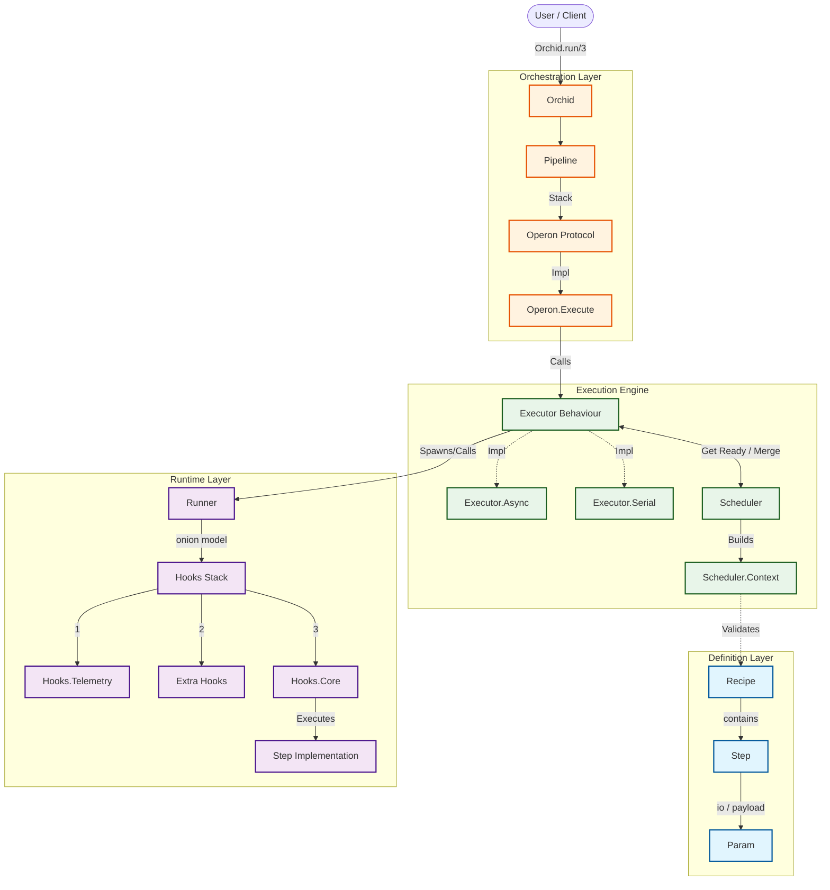
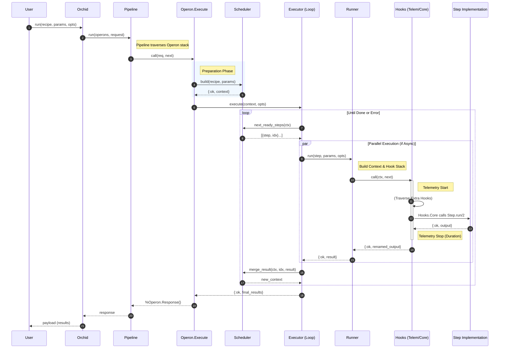

```mermaid
graph TD
    %% --- Styles ---
    classDef definition fill:#e1f5fe,stroke:#01579b,stroke-width:2px;
    classDef core fill:#fff3e0,stroke:#e65100,stroke-width:2px;
    classDef execution fill:#e8f5e9,stroke:#1b5e20,stroke-width:2px;
    classDef runtime fill:#f3e5f5,stroke:#4a148c,stroke-width:2px;
    classDef user fill:#eceff1,stroke:#37474f,stroke-dasharray: 5 5;

    User([User / Client]) -->|Orchid.run/3| API[Orchid]:::core

    subgraph Definition [Definition Layer]
        Recipe[Recipe]:::definition
        Step[Step]:::definition
        Param[Param]:::definition
        Recipe -->|contains| Step
        Step -->|io / payload| Param
    end

    subgraph Core [Orchestration Layer]
        API --> Pipeline:::core
        Pipeline -->|Stack| Operon[Operon Protocol]:::core
        Operon -->|Impl| OpExec[Operon.Execute]:::core
    end

    subgraph Execution [Execution Engine]
        OpExec -->|Calls| Executor[Executor Behaviour]:::execution
        Executor -.->|Impl| ExecAsync[Executor.Async]:::execution
        Executor -.->|Impl| ExecSerial[Executor.Serial]:::execution
        
        Executor <-->|Get Ready / Merge| Scheduler:::execution
        Scheduler -->|Builds| Context[Scheduler.Context]:::execution
        Context -.->|Validates| Recipe
    end

    subgraph RunnerSys [Runtime Layer]
        Executor -->|Spawns/Calls| Runner:::runtime
        Runner -->|onion model| HookStack[Hooks Stack]:::runtime
        
        HookStack -->|1| H_Telem[Hooks.Telemetry]:::runtime
        HookStack -->|2| H_Extra[Extra Hooks]:::runtime
        HookStack -->|3| H_Core[Hooks.Core]:::runtime
        
        H_Core -->|Executes| StepImpl[Step Implementation]:::runtime
    end
```

```mermaid
sequenceDiagram
    autonumber
    participant User
    participant Orchid
    participant Pipe as Pipeline
    participant OpExec as Operon.Execute
    participant Sched as Scheduler
    participant Exec as Executor (Loop)
    participant Runner
    participant Hooks as Hooks (Telem/Core)
    participant Step as Step Implementation

    User->>Orchid: run(recipe, params, opts)
    
    Orchid->>Pipe: run(operons, request)
    note right of Pipe: Pipeline traverses Operon stack
    
    Pipe->>OpExec: call(req, next)
    
    rect rgb(240, 248, 255)
        note right of OpExec: Preparation Phase
        OpExec->>Sched: build(recipe, params)
        Sched-->>OpExec: {:ok, context}
    end
    
    OpExec->>Exec: execute(context, opts)
    
    loop Until Done or Error
        Exec->>Sched: next_ready_steps(ctx)
        Sched-->>Exec: [{step, idx}...]
        
        par Parallel Execution (if Async)
            Exec->>Runner: run(step, params, opts)
            
            note right of Runner: Build Context & Hook Stack
            Runner->>Hooks: call(ctx, next)
            
            activate Hooks
            note right of Hooks: Telemetry Start
            Hooks->>Hooks: (Traverse Extra Hooks)
            
            Hooks->>Step: Hooks.Core calls Step.run/2
            Step-->>Hooks: {:ok, output}
            
            note right of Hooks: Telemetry Stop (Duration)
            deactivate Hooks
            
            Hooks-->>Runner: {:ok, renamed_output}
            Runner-->>Exec: {:ok, result}
        end
        
        Exec->>Sched: merge_result(ctx, idx, result)
        Sched-->>Exec: new_context
    end

    Exec-->>OpExec: {:ok, final_results}
    OpExec-->>Pipe: %Operon.Response{}
    Pipe-->>Orchid: response
    
    Orchid-->>User: payload (results)
```
